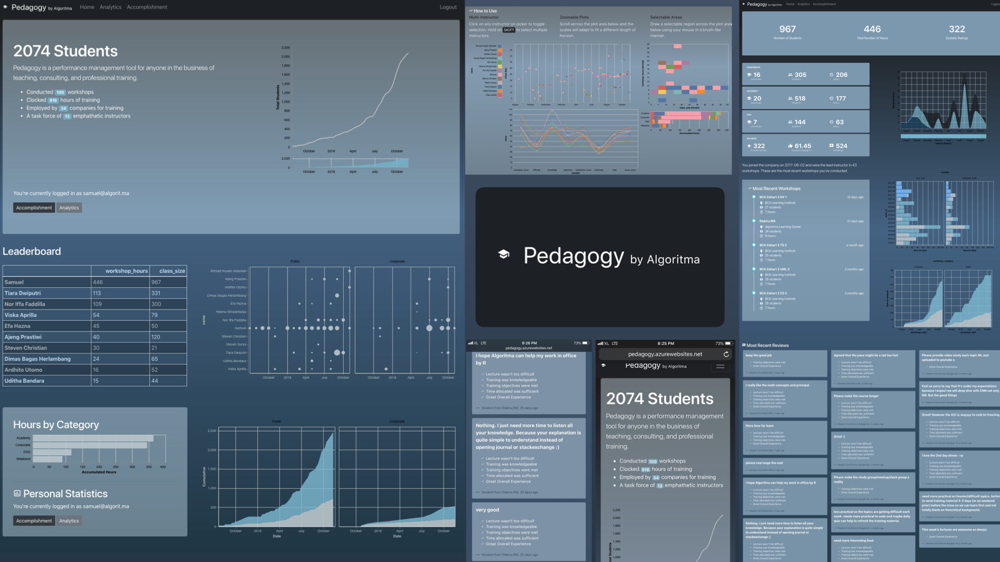

# Background
Pedagogy is a performance management tool for education professionals. It is developed within Algoritma, a data science education center.

## Main Features

At its current release (v0.1), Pedagogy delivers key performance indicators and assembly-wide analytics to its employees and training roster. The initial release includes three main modules:
- Company-wide statistics
    - Number of students 
    - Number of workshop hours 
    - Task Force 
    - Number of Clients
    - Leaderboard
        - Rank the 10 most prolific instructors
    - Visualization

- Instructor Analytics
    - An interactive tool to help visualize the performance and contribution of each instructors over time through zoomable plot, selectable plot areas and multi-select legends

- Personal Accomplishments
    - Accumulative Statistics
    - Key Milestones
    - Performance Indicators
    - Timeline View
    - Student Reviews

## Deployment

Pedagogy is deployed on Azure and can be accessed on http://pedagogy.azurewebsites.net